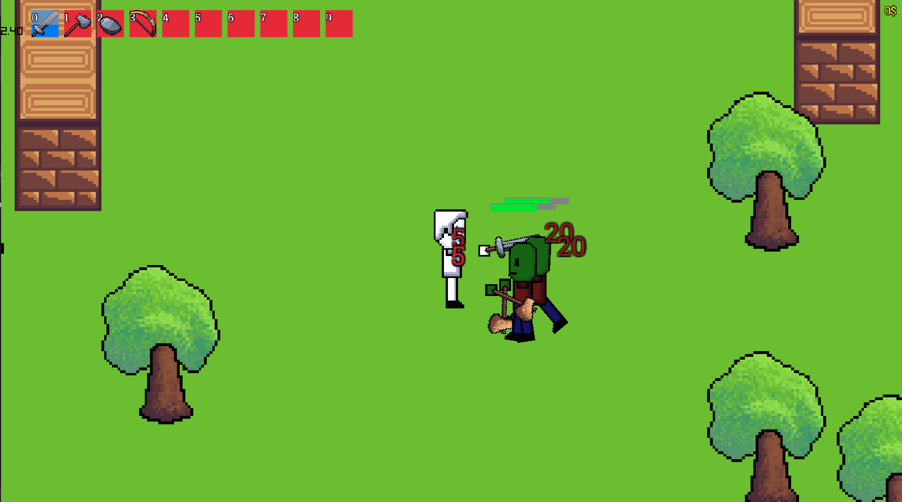
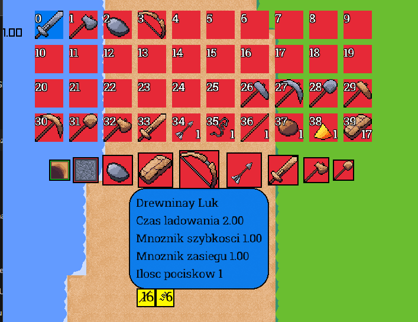

# GameEngine2D

## Opis
Projekt zainspirowany popularnymi sulwiwalarami jak core keeper czy terraria. Praca inżynierska powstał jako projekt pokazujący umiejętonosci nabyte na pierwszym stopniu studiów.

## System Walki
W grze znalazł się system walki bronią białą oraz dystansową.

## Handel i tworzenie przedmiotów
Pojawił się takrze system kupowania przedmiotów od postaci niezaleznych oraz mozliwość tworzenia samemu przemiotów.

## Narzędzia dodatkowe
W grze pojawił się system do dodawania własnych przedmiotów oraz receptur które nastepnie zostaną dodane do gry

